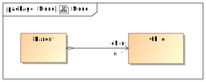

= uml-unittest-generator

image:https://circleci.com/gh/dschoenicke/uml-unittest-generator/tree/master.svg?style=svg&circle-token=780545d7ca8a2ad1c928eb4575fd649145884f9a["CircleCI", link="https://circleci.com/gh/dschoenicke/uml-unittest-generator/tree/master"]

A tool to generate jUnit tests out of a given UML class diagram representation. + 
A diagram representation of a modeling tool is converted in multiple steps to a final representation,
which can be converted to actual test files. +
The core project provides the conversion of Magic Draw diagrams to jUnit test files. + 
The application is extensible for further input diagram representations and output test cases.

A documentation containing all necessary information about the architecture, representations, converters
and instructions on how to write input/output converters, can be found link:documentation/developer_documentation.adoc[here].

== Building the project
To build the project locally, use the commands `mvn install` or `mvn package`. +
The build requires *JDK 11* or later. 

The code is organized in the following subprojects: +
....
uml-unittest-converter
├── converter-code-test
├── converter-uml-code
├── core
├── input-mdxml-converter
├── input-mdxml-representation
├── output-junit-converter
├── output-junit-representation
├── representation-code
├── representation-test
├── representation-uml
....

The different projects containing the internal representations are designated with
the prefix `representation-[name]`. A project for an input representation and its converter, which converts it
to the _UML representation_ is designated with the prefix `input-[name]-representation` and `input-[name]-converter`. + 
The same rule applies for output converters: `output-[name]-converter`. + 
The `core` project acts as a coordinator, delegating the conversion steps
to the corresponding subprojects.

== Usage
The tool provides three main functionalities: converting diagrams to test files,
managing qualified names and managing association types. + 
These functionalitites with their corresponding commands will be described in the following section.

=== Converting diagrams to test files
The following tables lists all commands with their arguments and describes their functionalities.

[options="header"]
[cols="3, 1, 10, 7"]
|===
| Command | Alias | Arguments | Description
| -createtests | -ct | <input-type> <input-path> <output-type> <output-path> | converts a given diagram file of a given input the test files of a given type in a given directory
| -inputtypes | -it | - | shows a list of all supported input formats
| -outputtypes |-ot | - | shows a list of all supported output formats
|===

==== Example
....
-ct mdxml project\documentation\diagram.xml junit project\src\test\java
....
The above command looks for a file `diagram.xml` in the given directory, assuming its a Magic Draw project file and converts it to
jUnit tests in the given `src\test\java` directory.

=== Managing qualified names
By default the tool generates fully qualified names for each class by combining the package names containing the class.
This might not be a problem for application classes, but as soon as the diagram contains external framework classes, this would require to 
model the complete package structure of the external class. Therefore the tool provides functions to assign fully qualified names to classes.

The following tables lists all commands with their arguments and describes their functionalities.

[options="header"]
[cols="4, 1, 5, 7"]
|===
| Command | Alias | Arguments | Description
| -showqualifiednames | -sqn | - | shows a list of all manually assigned fully qualified names
| -addqualifiedname | -aqn | <classname> <qualified-name> | assigns a given fully qualified name to the given class name
| -replacequalifiedname | -rqn | <classname> <qualified-name> | replaces the existing qualified name of a given class
| -deletequalifiedname | -dqn | <classname> | deletes the fully qualified name for a given class
| -clearqualifiednames | -cqn | - | deletes all manual assignments of fully qualified names
|===

==== Example
Consider an application using the link:http://javadox.com/org.javamoney/moneta/1.0/org/javamoney/moneta/Money.html[Java - Money] class. +
Use `-aqn Money org.javamoney.moneta.Money` to assign the fully qualified name to the class without having the need to model the package structure to enable the tool to generate the qualified name itself.

=== Managing association types
UML does not provide an straightforward way to determine the exact collection type of an association since it is not intended to have such definitions in a class diagram. Without any type definition, the tool considers
any association with `*` as the upper multiplicity value is considered an array. The tool provides the following commands to assign concrete collection types to an association field.

[options="header"]
[cols="4, 1, 5, 7"]
|===
| Command | Alias | Arguments | Description
| -showassociationtypes | -sat | - | shows a list of all association types of class fields
| -addassociationtype | -aat | <field> <association-type> | assigns a given association type to a given field
| -replaceassociationtype | -rat | <field> <association-type> | replaces the association type of a given field
| -deleteassociationtype | -dat | <field> | deletes the association type for a given field
| -clearassociationtypes | -cat | - | deletes association types of class fields
|===

==== Example
Consider the following association: +

The class `parent` can have zero or more instances of `child`. Without any more information, the field `Parent.childs` is considered to be an array. +
The command `-aat Parent.childs java.util.List` changes the type of `Parent.child` from `Child` to `java.util.List<Child>` which allows the tool to check
if this collection is used in the implementation. 

*Note: All fields have to be denoted with `<classname>.<fieldname>`*
