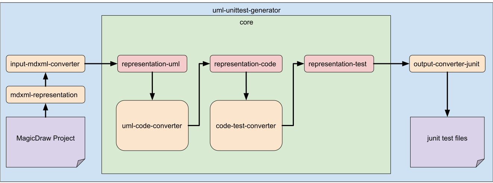

:toc: left
:numbered:
:toclevels: 2
:sectlinks:

= uml-unittest-generator

[options="header"]
[cols="1, 3, 3"]
|===
|Version | Processing Date   | Author 
|0.2	| November 28th, 2019 | Daniel Schoenicke 
|===

== Context
* Task description

== Constraints
* Definition of constraints for the input diagrams

== Architecture
[caption="Figure 1: Top Level Architecture"]

The project _uml-unittest-generator_ is a Maven parent project, which consists
of the _core_-module and additional modules of input representations and converters, 
as well as output converters. +
The _core_ module contains the three representations (_Uml, Code, Test_), which are
Maven modules themselves, and the two converters for these representations. The representations
abstract an input diagram step-by-step to an output format. +

For more information on the representations, see chapter <<#representations>>. + 
For more information on the converters, see chapter <<#converters>>.

_Representation-uml_ acts as an interface for input diagrams, to which an input representation
needs to be converted (see <<#input>> for a description of the _mdxml-uml-converter_). +
To generate an output other than _jUnit Structure Tests_, another output converter using _representation-test_
as input needs to be implemented (see <<#output>> for a description of the _test-junit-converter_).

[#input]
== Input
* Description of how to implement an input representation and converter with the mdxml representation as an example

[#output]
== Output
* Description of how to implement an output representation and converter

[#representations]
== Representations
During the conversion process, the input diagram is converted
to several representations before an output is generated. The following section contains descriptions
of each of these representations and references to their respective javadocs.

=== UML-Representation
The UML representation presentation acts as the first abstraction of the input class diagram within
the application. The diagram representation of a modeling tool has to be converted to this representation
in a first step. Therefore, the UML representation provides an interface for a converter, which converts
a diagram representation of a modeling tool to the UML representation.

==== Package: uml
link:javadoc/uml/package-summary.html[Javadoc of the uml package]

The uml package contains all model classes of the representation. The representation has a tree structure
with an instance of _UmlModel_ as the root node. The _UmlModel_ holds lists of _UmlElements_ and _UmlRelationships_,
which are not assigned to a package. Furthermore it holds a list of _UmlPackages_, which contain _UmlElements_, _UmlRelationships_
and _UmlPackages_.

_UmlElement_ is an abstract class, which is extended by _UmlClass_, _UmlInterface_ and _UmlEnumeration_. These three subclasses
are distinguished by their non access modifiers. Furthermore, _UmlEnumerations_ have a list of _UmlLiterals_.

_UmlElements_ have a list of _UmlAttributes_ and _UmlOperations_, as well as lists of _UmlTemplateBindings_ and _UmlTemplateParameters_.
The enumeration _UmlVisibility_ determines the access modifier of _UmlElements_, _UmlAttributes_ and _UmlOperations_. The _UmlParameters_
of _UmlOperations_ have a direction, determined by the _UmlParameterDirection_ - enumeration, which helps to distinguish input- and return parameters. 
Furthermore, the multiplicity of _UmlAttributes_ and _UmlParameters_ is determined by the _UmlMultiplicityValue_ - enumeration, which describes
the upper and lower value of the multiplicity.

_UmlTemplateBindings_ have one or more _UmlParameterSubstitution_, which maps the type of the substitute to the corresponding _UmlTemplateParameter_.

Relationships are described by an _UmlRelationship_ object, which has a client and a supplier, both as a reference to an _UmlElement_. If the relationship
is undirected, the assignment of client and supplier is arbitrary. The type of the relationship is determined by the _UmlRelationshipType_ - enumeration.

==== Package: uml.converterinterface
link:javadoc/uml/converterinterface/package-summary.html[Javadoc of the uml.converterinterface package]

This package contains an interface, which defines a conversion method, that returns the converted _UmlModel_ out of a given _UmlInputRepresentation_.
The _UmlInputRepresentation_ - interface needs to be implemented by the root object of the input representation to be converted.

=== Code-Representation
link:javadoc/code/package-summary.html[Javadoc of the code package]

The code representation aims to provide compatibility to the Java Reflection API. The representation contains no relationships, as they are implicated
via the class fields and references to super classes and interfaces, which is held by each _CodeElement_. 

Furthermore, the modifiers of a _CodeElement_, _CodeField_, _CodeMethod_ and _CodeParameter_ are represented by an
integer value calculated in the same way, as Java Reflection does (see: link:https://docs.oracle.com/javase/8/docs/api/constant-values.html#java.lang.reflect.Modifier.ABSTRACT[List of java.reflect.Modifier enum constants]).
Therefore, the class _CodeModifier_ extends the class java.lang.reflect.Modifier and adds a method to calculate the integer modifier
out of a _CodeVisibility_ and boolean values for the _static_, _final_ and _abstract_ modifier.

While the UML representation can contain _CodeElements_ at the top level without a _UmlPackage_, the _CodeElements_ without a package in the diagram
are grouped into a _CodePackage_ with the name of the model.

[#converters]
== Converters
* Descriptions of all the converters

=== converter-uml-code

=== converter-code-test

== Tests
* Description of the test strategy
